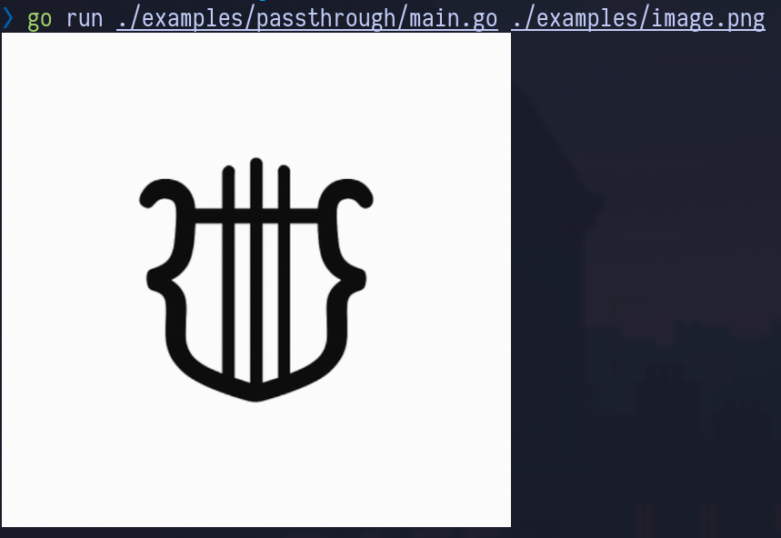

# chafa-go

[](https://pkg.go.dev/github.com/ploMP4/chafa-go)

**chafa-go** provides Go bindings for the [Chafa](https://hpjansson.org/chafa/) C library using [purego](https://github.com/ebitengine/purego), meaning **no CGO is required**. Chafa is a powerful image-to-text converter for terminal graphics, supporting a variety of character sets, color modes, and dithering options.

<div align="center">
  
</div>

There are precompiled `libchafa` shared objects embedded in the repository using Go’s `embed` feature.  
These binaries are automatically built from the official Chafa source and committed via a GitHub Action.  
At runtime, the correct binary for your platform is selected and loaded dynamically.

Currently Supported Platforms:

- linux/amd64
- linux/386
- darwin/arm64
- windows/amd64

## Installation

```bash
go get github.com/ploMP4/chafa-go
```

## Usage

Basic usage is shown below. For more complete examples, see the [examples/](./examples/) directory.

```go
package main

import (
	"fmt"

	"github.com/ploMP4/chafa-go"
)

const (
	PixWidth  = 3
	PixHeight = 3
	NChannels = 4
)

func main() {
	pixels := []uint8{
		0xff, 0x00, 0x00, 0xff, 0x00, 0x00, 0x00, 0xff, 0xff, 0x00, 0x00, 0xff,
		0x00, 0x00, 0x00, 0xff, 0xff, 0x00, 0x00, 0xff, 0x00, 0x00, 0x00, 0xff,
		0xff, 0x00, 0x00, 0xff, 0x00, 0x00, 0x00, 0xff, 0xff, 0x00, 0x00, 0xff,
	}

	// Specify the symbols we want
	symbolMap := chafa.SymbolMapNew()
	defer chafa.SymbolMapUnref(symbolMap)

	chafa.SymbolMapAddByTags(symbolMap, chafa.CHAFA_SYMBOL_TAG_ALL)

	//  Set up a configuration with the symbols and the canvas size in characters
	config := chafa.CanvasConfigNew()
	defer chafa.CanvasConfigUnref(config)

	chafa.CanvasConfigSetGeometry(config, 40, 20)
	chafa.CanvasConfigSetSymbolMap(config, symbolMap)

	// Create canvas
	canvas := chafa.CanvasNew(config)
	defer chafa.CanvasUnRef(canvas)

	// Draw pixels to canvas
	chafa.CanvasDrawAllPixels(
		canvas,
		chafa.CHAFA_PIXEL_RGBA8_UNASSOCIATED,
		pixels,
		PixWidth,
		PixHeight,
		PixWidth*NChannels,
	)

	// Generate a string that will show the canvas contents on a terminal
	gs := chafa.CanvasPrint(canvas, nil)

	fmt.Println(gs)
}
```

## Contributing

All contributions are welcome! If you're planning a significant change or you're unsure about an idea, please open an issue first so we can discuss it in detail.

## Acknowledgments

- [Chafa](https://hpjansson.org/chafa/) by Hans Petter Jansson
- [purego](https://github.com/ebitengine/purego) by the Ebitengine project
